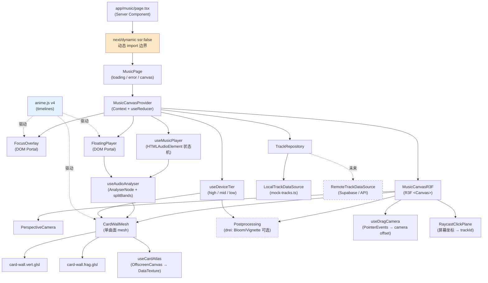

# Design Document: Music Fisheye Canvas（方案 A：WebGL + R3F）

## 1. Overview

`music-fisheye-canvas` 是 `/music` 路由下的沉浸式音乐发现页面。本设计采用 **方案 A：WebGL + React Three Fiber (R3F) + anime.js**，通过单一曲面 mesh + GLSL shader 完成统一空间扭曲，叠加纹理图集（texture atlas）承载所有卡片视觉，实现「整面墙弯成穹顶」的视觉目标。

### 1.1 与第一轮 CSS 3D 方案的本质区别

| 维度 | 第一轮（CSS 3D transform，已废弃） | 第二轮（WebGL + R3F，本方案） |
|------|-----------------------------------|----------------------------|
| 变形单位 | 每张卡片 DOM 各自做 `perspective + rotateX/Y/scale` | **单 mesh 整面曲面**，shader 在 vertex 阶段把平面顶点投影到球面 |
| 空间一致性 | 卡片之间没有共同弯曲表面（逐元素假透视） | **统一空间扭曲**，所有卡片共享同一个球面投影 |
| 渲染上限 | 受 DOM 节点数量限制，一屏 3-4 张就吃力 | 单 draw call 渲染整面墙，一屏 50+ 张毫无压力 |
| 视觉目标 | 边缘卡片轻微倾斜（看不出鱼眼） | 边缘卡片真实透视压缩 + 暗角 vignette（穹顶感） |
| 性能开销 | CPU 重排 + 合成层数量爆炸 | GPU shader 一次后处理 |

### 1.2 核心立场

- **单 mesh + 单 draw call**：整面卡片墙是一个细分 `PlaneGeometry`，由 shader 投影到球面（或 sphere-cap 子集）
- **纹理图集**：所有卡片视觉（封面 + 标题 + 控件区 + 进度条）预渲染到单张大 texture，shader 通过 UV 在图集上采样
- **拖拽 = UV 偏移 / camera 平移**：用户拖拽不创建/销毁 mesh，仅更新 uniforms（落地 NFR-2）
- **DOM 装饰层**：FocusOverlay / FloatingPlayer 仍是 DOM（在 R3F Canvas 之上），通过 React Portal 挂 `document.body` 规避 PageTransition 的 transform 污染
- **anime.js v4 协同 R3F**：装饰性动画（入场错峰、idle 呼吸、focus 飞入、悬浮播放器进出场）由 anime.js timeline 驱动 mesh material 的 uniforms
- **整页懒加载**：three / R3F / drei / animejs 通过 `next/dynamic({ ssr: false })` 隔离在 `/music` chunk（落地 NFR-13）

### 1.3 视觉目标（参考用户提供的设计图）

- 整面墙弯成穹顶，从中心向四周连续弯曲，边缘卡片有真实透视压缩 + 倾斜
- 一屏 50+ 张迷你卡片，每张约 100×130px（封面在上，下方半透明黑色控件区含 ⏮ ▶/⏸ ⏭ 三键 + 进度条）
- 暗角 vignette：边缘明显比中心暗，强化「看进盒子」的体感
- 统一冷蓝色调（color grading 后处理）
- 细微 idle 呼吸感（uCurvature 周期性微小波动）

---

## 2. Architecture

### 2.1 高层架构图



### 2.2 分层职责

| 层级 | 模块 | 职责 |
|------|------|------|
| 路由层 | `app/music/page.tsx` | Server Component 入口，仅渲染 dynamic 包装容器（无 R3F 引入） |
| 动态边界 | `app/music/music-page.client.tsx` | `"use client"` + `next/dynamic({ ssr: false })` 懒加载 R3F 子树（NFR-13） |
| 状态层 | `MusicCanvasProvider` | Context + useReducer 管理跨组件状态（focusedId / floatingId / dragging / cameraOffset） |
| R3F 渲染层 | `MusicCanvasR3F`、`CardWallMesh`、`RaycastClickPlane` | R3F 树，所有 Three 对象在此 |
| Shader 层 | `shaders/card-wall.vert.glsl`、`shaders/card-wall.frag.glsl` | 球面投影 + atlas 采样 + vignette + audio uniforms |
| 交互层 | `useDragCamera`、`useWheelCamera` | PointerEvents / WheelEvents → camera/uniform offset，含惯性 |
| 数据层 | `TrackRepository`、`LocalTrackDataSource`、`mock-tracks.ts` | 数据访问契约 + 本地实现 |
| 播放层 | `useMusicPlayer` | HTMLAudioElement 状态机，单例 |
| 音频分析层 | `useAudioAnalyser`、`audio-analysis.ts` | `AnalyserNode` + `splitBands(bass/mid/high)` |
| 装饰动画层 | `anime.js` timelines | 入场 stagger、idle 呼吸、focus 飞入、悬浮播放器进出场 |
| DOM 装饰层 | `FocusOverlay`、`FloatingPlayer` | React Portal 至 `document.body`，CSS `backdrop-filter` 玻璃质感 |

### 2.3 状态管理

沿用项目惯例（参见 `contexts/posts-context.tsx`），**React Context + `useReducer`**，**不引入 zustand**。

```typescript
// lib/music/reducer.ts
export type MusicCanvasState = {
  cameraOffset: { x: number; y: number };  // 世界坐标
  velocity: { x: number; y: number };       // 惯性速度
  isDragging: boolean;
  isInertia: boolean;
  focusedTrackId: string | null;
  floatingTrackId: string | null;
  playerState: 'idle' | 'loading' | 'playing' | 'paused' | 'error';
  audioBands: AudioBands;                   // { bass, mid, high } ∈ [0,1]
  deviceTier: DeviceTier;                   // 'high' | 'mid' | 'low'
}

export type MusicCanvasAction =
  | { type: 'DRAG_START'; pointer: { x: number; y: number } }
  | { type: 'DRAG_MOVE'; delta: { x: number; y: number } }
  | { type: 'DRAG_END'; velocity: { x: number; y: number } }
  | { type: 'INERTIA_TICK'; dt: number }
  | { type: 'INERTIA_STOP' }
  | { type: 'FOCUS'; trackId: string }
  | { type: 'UNFOCUS' }
  | { type: 'PLAY'; trackId: string }
  | { type: 'PAUSE' }
  | { type: 'CLOSE_FLOATING' }
  | { type: 'AUDIO_BANDS'; bands: AudioBands }
  | { type: 'TIER'; tier: DeviceTier };
```

### 2.4 代码分割边界（NFR-13 落地）

```
app/music/page.tsx              ← server component（不含 three/R3F）
  └─ <MusicPageDynamic />       ← next/dynamic({ ssr: false, loading: ... })
       └─ components/music/music-page.client.tsx     ← "use client"
            ├─ import 'three'                        ← 都进 /music chunk
            ├─ import '@react-three/fiber'
            ├─ import '@react-three/drei'
            ├─ import 'animejs'
            └─ <MusicCanvasProvider>...</MusicCanvasProvider>
```

- `app/music/page.tsx` 是 Server Component，**不直接 import R3F**
- 所有 R3F / animejs 引用必须通过 `music-page.client.tsx` 这一动态边界
- 验证手段：`pnpm run analyze` 后检查 `/music` chunk 包含 three，其他路由不包含

---

## 3. Components and Interfaces

按 RESTART.md §9 文件树展开。

### 3.1 路由与入口

#### `app/music/page.tsx`
```typescript
// Server Component，仅承载 dynamic 边界
import { MusicPageDynamic } from '@/components/music/music-page-dynamic'
export default function MusicPage() {
  return <MusicPageDynamic />
}
```

#### `components/music/music-page-dynamic.tsx`
```typescript
"use client"
import dynamic from 'next/dynamic'
const MusicPageClient = dynamic(
  () => import('./music-page.client').then(m => m.MusicPageClient),
  { ssr: false, loading: () => <MusicSkeleton /> }
)
export const MusicPageDynamic = MusicPageClient
```

#### `components/music/music-page.client.tsx`
```typescript
"use client"
import { MusicCanvasProvider } from './music-canvas-provider'
import { MusicCanvasR3F } from './music-canvas-r3f'
import { FocusOverlay } from './focus-overlay'
import { FloatingPlayer } from './floating-player'

export function MusicPageClient() {
  return (
    <MusicCanvasProvider>
      <MusicCanvasR3F />
      <FocusOverlay />
      <FloatingPlayer />
    </MusicCanvasProvider>
  )
}
```

### 3.2 R3F 渲染层

#### `components/music/music-canvas-r3f.tsx`
```typescript
"use client"
import { Canvas } from '@react-three/fiber'
import { CardWallMesh } from './card-wall-mesh'
import { RaycastClickPlane } from './raycast-click-plane'

export function MusicCanvasR3F() {
  return (
    <div
      className="fixed inset-0"
      style={{ width: '100vw', height: '100vh', touchAction: 'none' }}
    >
      <Canvas
        dpr={[1, 2]}
        gl={{ antialias: true, alpha: false, powerPreference: 'high-performance' }}
        camera={{ fov: 55, near: 0.1, far: 100, position: [0, 0, 4] }}
      >
        <color attach="background" args={['#070912']} />
        <CardWallMesh />
        <RaycastClickPlane />
      </Canvas>
    </div>
  )
}
```

容器使用 `position: fixed; width: 100vw; height: 100vh` inline style 而非 Tailwind 类，规避 PageTransition motion.div transform 污染 fixed 后代 containing block 的已知坑。`touch-action: none` 落地 NFR-11。

#### `components/music/card-wall-mesh.tsx`
```typescript
"use client"
import { useFrame, useThree } from '@react-three/fiber'
import { ShaderMaterial, PlaneGeometry, Mesh } from 'three'
import { useCardAtlas } from '@/hooks/music/use-card-atlas'
import { useDragCamera } from '@/hooks/music/use-drag-camera'
import { useMusicCanvas } from './music-canvas-provider'
import { vertexShader, fragmentShader } from './shaders/card-wall'

export interface CardWallMeshProps {
  curvature?: number
  vignetteStrength?: number
}

export function CardWallMesh(props: CardWallMeshProps): JSX.Element {
  const { state } = useMusicCanvas()
  const atlas = useCardAtlas(state.tracks, state.deviceTier)
  const { onPointerDown, onPointerMove, onPointerUp } = useDragCamera()

  // segments by tier: high=128, mid=64, low=24
  const segments = state.deviceTier === 'high' ? 128
                 : state.deviceTier === 'mid'  ? 64 : 24

  // useRef + useFrame to update uniforms each frame
  // ...
}
```

#### `components/music/raycast-click-plane.tsx`
- 监听 `<Canvas>` 上的 `onClick`，把屏幕坐标通过 raycaster 投到 mesh
- 用命中点的 `uv` 反查 atlas 行列号 → trackId
- 派发 `{ type: 'FOCUS', trackId }`

### 3.3 DOM 装饰层（Portal 至 document.body）

#### `components/music/focus-overlay.tsx`
```typescript
"use client"
import { createPortal } from 'react-dom'
import { useMusicCanvas } from './music-canvas-provider'

export function FocusOverlay(): JSX.Element | null {
  const { state, dispatch } = useMusicCanvas()
  if (!state.focusedTrackId) return null
  return createPortal(
    <div
      style={{
        position: 'fixed',
        inset: 0,
        backdropFilter: 'blur(20px) saturate(1.6)',
        background: 'rgba(7, 9, 18, 0.55)',
        zIndex: 50
      }}
      onClick={() => dispatch({ type: 'UNFOCUS' })}
    >
      {/* 焦点卡片 + 播放按钮 */}
    </div>,
    document.body
  )
}
```

液态玻璃效果用 CSS `backdrop-filter` 实现，**不再依赖 liquid-glass-react**（peer 锁 React 19，与项目 React 18 不兼容）。

#### `components/music/floating-player.tsx`
- 类似 Portal 模式，固定在 `right: 16px; bottom: 16px`
- 显示当前曲目封面、标题、进度条、播放/暂停、关闭
- 外圈光晕由 `audioBands.bass` 驱动半径 + opacity（NFR-9 节流，dband ≤ 0.5/帧）

### 3.4 Hooks 层

| Hook | 路径 | 返回值要点 |
|------|------|----------|
| `useMusicPlayer` | `hooks/music/use-music-player.ts` | `{ state, play, pause, close, audioRef }`；HTMLAudioElement 单例，错误自动切换为 'error' |
| `useTracks` | `hooks/music/use-tracks.ts` | `{ tracks, isLoading, error, retry }`；包装 TrackRepository |
| `useDragCamera` | `hooks/music/use-drag-camera.ts` | PointerEvents handlers + 惯性循环；输出 cameraOffset 到 reducer |
| `useWheelCamera` | `hooks/music/use-wheel-camera.ts` | 仅 desktop + non-low tier 启用；wheel → 阻尼累加 |
| `useCardAtlas` | `hooks/music/use-card-atlas.ts` | `{ texture, layout, isReady }`；OffscreenCanvas 渲染 → DataTexture 上传 |
| `useDeviceTier` | `hooks/music/use-device-tier.ts` | `'high' \| 'mid' \| 'low'`，单一来源；prefers-reduced-motion → low |
| `useAudioAnalyser` | `hooks/music/use-audio-analyser.ts` | `bands: AudioBands`；fftSize=256；splitBands |
| `useEntryAnimation` | `hooks/music/use-entry-animation.ts` | anime.js stagger 驱动 entryProgress uniform |

### 3.5 纯函数库

| 模块 | 路径 | 职责 |
|------|------|------|
| `types.ts` | `lib/music/types.ts` | `Track`、`MusicCanvasState`、`AtlasLayout`、`CardSlot`、`PlayerState`、`DeviceTier`、`AudioBands`、`FisheyeUniforms` |
| `mock-tracks.ts` | `lib/music/mock-tracks.ts` | 50-100 首本地 mock 数据（封面指向 `public/covers/*.jpg`） |
| `repository.ts` | `lib/music/repository.ts` | 数据访问契约 `TrackRepository` |
| `local-data-source.ts` | `lib/music/local-data-source.ts` | 本地实现 |
| `reducer.ts` | `lib/music/reducer.ts` | 状态机；纯函数；惯性公式 |
| `audio-analysis.ts` | `lib/music/audio-analysis.ts` | `splitBands(timeDomain, sampleRate) → AudioBands` 纯函数 |
| `device-tier.ts` | `lib/music/device-tier.ts` | `detectDeviceTier(env) → DeviceTier` 纯函数 |
| `atlas.ts` | `lib/music/atlas.ts` | `computeAtlasLayout(count, atlasSize, cardSize) → AtlasLayout` 纯函数 |
| `geometry.ts` | `lib/music/geometry.ts` | 鱼眼数学（CPU 校验用，shader 是参考实现）+ raycast UV → row/col 反查 |

---

## 4. Shader Design

### 4.1 Uniforms 命名约定

| Uniform | 类型 | 含义 |
|---------|------|------|
| `uAtlas` | `sampler2D` | 卡片纹理图集 |
| `uAtlasGrid` | `vec2` | 图集行列数 (cols, rows) |
| `uTileCount` | `vec2` | 一个完整 Tile 的卡片行列数 |
| `uOffset` | `vec2` | 当前 camera/UV 偏移（世界坐标） |
| `uCurvature` | `float` | 球面曲率，0 = 平面，1 = 完整半球 |
| `uVignetteStrength` | `float` | 暗角强度 |
| `uTime` | `float` | 累计时间，秒 |
| `uBandsBass` / `uBandsMid` / `uBandsHigh` | `float` | 频谱三段强度 ∈ [0,1] |
| `uEntryProgress` | `float` | 入场动画进度 ∈ [0,1] |
| `uColorGrade` | `vec3` | 冷蓝色调偏移 |

### 4.2 Vertex Shader 伪代码

```glsl
// shaders/card-wall.vert.glsl
uniform vec2 uOffset;
uniform float uCurvature;
uniform float uTime;
uniform float uEntryProgress;

varying vec2 vUv;
varying vec3 vWorldPos;
varying float vDistFromCenter;

void main() {
  vUv = uv;

  // 1. 平面坐标（PlaneGeometry 在 XY 平面，已细分为 segments × segments）
  vec3 pos = position;

  // 2. 球面投影：把 (x, y) 映射到球面，z = -curvature * (x² + y²)
  //    pos.xy 范围约 [-1, 1]（PlaneGeometry args 默认）
  float r2 = pos.x * pos.x + pos.y * pos.y;
  pos.z = -uCurvature * r2;

  // 3. 入场动画：从 z = -3 弹回 z = pos.z
  pos.z = mix(-3.0, pos.z, uEntryProgress);

  // 4. idle 呼吸：高 tier 时叠加微小波动
  pos.z += sin(uTime * 0.6) * 0.015 * uCurvature;

  // 5. 用于 fragment 的距离衰减
  vDistFromCenter = length(pos.xy);
  vWorldPos = pos;

  gl_Position = projectionMatrix * modelViewMatrix * vec4(pos, 1.0);
}
```

### 4.3 Fragment Shader 伪代码

```glsl
// shaders/card-wall.frag.glsl
uniform sampler2D uAtlas;
uniform vec2 uAtlasGrid;     // (cols, rows) of atlas
uniform vec2 uTileCount;     // (cols, rows) of one tile
uniform vec2 uOffset;        // 世界偏移
uniform float uVignetteStrength;
uniform float uBandsBass;
uniform float uBandsMid;
uniform float uBandsHigh;
uniform vec3 uColorGrade;
uniform float uEntryProgress;

varying vec2 vUv;
varying float vDistFromCenter;

void main() {
  // 1. 把 mesh uv ∈ [0,1] 映射到世界 tile 坐标
  vec2 worldUv = vUv * uTileCount + uOffset;

  // 2. mod 到一个 tile 周期内（Tile 周期性 NFR-6）
  vec2 tileUv = mod(worldUv, uTileCount);

  // 3. 取卡片行列号
  vec2 cardIdx = floor(tileUv);

  // 4. 卡片局部 UV ∈ [0,1]
  vec2 localUv = fract(tileUv);

  // 5. atlas 采样：把 (cardIdx, localUv) 映射到 atlas 的全局 UV
  vec2 atlasUv = (cardIdx + localUv) / uAtlasGrid;
  vec4 col = texture2D(uAtlas, atlasUv);

  // 6. vignette：距中心越远越暗，受 bass 微调
  float vignette = smoothstep(1.4, 0.0, vDistFromCenter);
  vignette = mix(vignette, vignette * (1.0 + uBandsBass * 0.15), 1.0);

  // 7. 冷蓝色调 grading
  col.rgb = mix(col.rgb, col.rgb * uColorGrade, 0.35);

  // 8. 边缘色温随 mid/high 频段轻微偏移
  col.rgb += vec3(0.0, uBandsMid * 0.05, uBandsHigh * 0.08) * (1.0 - vignette);

  // 9. 入场淡入
  col.a *= uEntryProgress;

  gl_FragColor = vec4(col.rgb * vignette, col.a);
}
```

### 4.4 PlaneGeometry 细分粒度（Device Tier 表）

| Tier | segments (W×H) | 顶点数 | 备注 |
|------|---------------|-------|------|
| `high` | 128×128 | 16,641 | 球面投影边缘平滑无锯齿 |
| `mid` | 64×64 | 4,225 | 边缘略可见多边形，可接受 |
| `low` | 24×24 | 625 | 接近平面，曲率 0.4 兜底视觉 |

---

## 5. Texture Atlas Design

### 5.1 总体策略

- **一次生成、多次复用**：tracks 数据一旦加载完毕，调用 `useCardAtlas` 一次性把所有卡片画到一张大 texture，转成 `THREE.CanvasTexture` 上传 GPU
- **OffscreenCanvas 优先**：`'OffscreenCanvas' in window` 时使用，避免阻塞主线程；fallback `HTMLCanvasElement`
- **本地封面**：mock 数据指向 `public/covers/cover-NN.jpg`，避免 picsum 异步加载导致首帧空白
- **重生成时机**：仅在 `tracks` 引用变化或 `deviceTier` 变化时重生成

### 5.2 Atlas 尺寸 / 卡片尺寸 / Device Tier 表

| Tier | Atlas 尺寸 | 单卡尺寸 | atlas 容量 | 备注 |
|------|----------|---------|----------|------|
| `high` | 4096×4096 | 256×320 | 16×12 = 192 张 | 卡片下方控件区像素清晰 |
| `mid` | 2048×2048 | 192×240 | 10×8 = 80 张 | 文字略糊但可读 |
| `low` | 2048×2048 | 160×200 | 12×10 = 120 张 | 关闭文字描边节省 GPU |

> 当曲目数量 N > atlas 容量时，多生成一张 atlas（最多 2 张），shader 通过 `uAtlasIndex` 选择采样源（本期默认 N ≤ atlas 容量）。

### 5.3 单张卡片渲染布局

```
┌────────────────────────┐  顶部 75%：封面图（drawImage with object-fit: cover）
│                        │  下方 25%：半透明黑色控件区
│      Cover Image       │
│                        │
│                        │
├────────────────────────┤
│  曲目标题              │  Title (12px Inter)
│  ⏮  ▶/⏸  ⏭     ━━●━━ │  控件按钮 + 进度条
└────────────────────────┘
```

- 控件区背景：`rgba(0, 0, 0, 0.55) + backdrop blur` 模拟磨砂玻璃
- 标题渲染：`ctx.fillText` + 截断 `…`
- 三键 + 进度条：用 Path2D 绘制 SVG 几何（未来可换成 sprite）

### 5.4 mipmap 策略

- `texture.minFilter = THREE.LinearMipmapLinearFilter`
- `texture.generateMipmaps = true`
- 防止边缘卡片缩小后摩尔纹

### 5.5 atlas 失败兜底

- OffscreenCanvas 创建失败 → fallback DOM canvas
- `drawImage` 报错 → 单卡降级为纯色块 + 文字
- atlas 上传失败（GL_OUT_OF_MEMORY）→ 降级到下一档 tier 重试一次，仍失败则进入静态封面 grid 模式（NFR-10）

---

## 6. Camera & Interaction

### 6.1 PerspectiveCamera 参数

```typescript
{
  fov: 55,          // 垂直视野角度
  near: 0.1,
  far: 100,
  position: [0, 0, 4]   // 距 mesh 平面 4 单位（mesh 在 z=0）
}
```

### 6.2 拖拽与惯性

**拖拽数据流**：

```
PointerDown on <Canvas>
  → reducer dispatch DRAG_START + 锁定 pointer
PointerMove (with capture)
  → 累加 delta 到 cameraOffset
  → 滑动窗口采样最近 5 次 (delta, t)
PointerUp / PointerCancel
  → 计算时间加权平均速度
  → reducer dispatch DRAG_END(velocity)
  → 启动惯性 rAF loop
INERTIA_TICK (每帧)
  → cameraOffset += velocity * dt
  → velocity *= exp(-friction * dt)   // 指数衰减
  → if |velocity| < 0.001 → DRAG_END_INERTIA → cancelAnimationFrame
```

**惯性参数**（沿用第一轮调好的值）：

| 参数 | 值 | 含义 |
|-----|----|----|
| `friction` | 4.0 (1/s) | 指数衰减常数 |
| `velocityWindowMs` | 120 | 速度采样时间窗 |
| `minVelocity` | 0.001 (units/s) | 停止阈值 |

惯性公式封装在 `reducer.ts` 中纯函数 `stepInertia(state, dt)`，方便 PBT。

### 6.3 Raycast 点击 → trackId

```typescript
// components/music/raycast-click-plane.tsx 关键算法
function uvToTrackId(uv: Vector2, offset: Vector2, tileCount: Vector2, tracks: Track[]): string | null {
  const worldUv = new Vector2(uv.x * tileCount.x + offset.x, uv.y * tileCount.y + offset.y)
  const tileUv = new Vector2(worldUv.x % tileCount.x, worldUv.y % tileCount.y)
  const col = Math.floor(tileUv.x)
  const row = Math.floor(tileUv.y)
  const idx = row * tileCount.x + col
  return tracks[idx % tracks.length]?.id ?? null
}
```

**拖拽与点击的歧义处理**：在 `useDragCamera` 中维护 `dragDistance`，PointerUp 时若 `dragDistance < 5px` 则视为点击，派发 raycast；否则视为拖拽结束启动惯性。

### 6.4 Wheel 平滑（Desktop + non-low tier）

- 不使用 Lenis（DOM 滚动库，不适配 R3F Canvas）
- 自实现 `useWheelCamera`：监听 `wheel` 事件 → 把 `deltaX/deltaY` 阻尼累加到目标 cameraOffset → 每帧用 lerp 趋近
- `prefers-reduced-motion: reduce` 时关闭

```typescript
// hooks/music/use-wheel-camera.ts 关键逻辑
const target = useRef({ x: 0, y: 0 })
useEffect(() => {
  const onWheel = (e: WheelEvent) => {
    if (deviceTier === 'low') return
    target.current.x += e.deltaX * wheelScale
    target.current.y += e.deltaY * wheelScale
  }
  window.addEventListener('wheel', onWheel, { passive: true })
  return () => window.removeEventListener('wheel', onWheel)
}, [deviceTier])

useFrame((_, dt) => {
  cameraOffset.x = lerp(cameraOffset.x, target.current.x, 1 - Math.exp(-8 * dt))
  cameraOffset.y = lerp(cameraOffset.y, target.current.y, 1 - Math.exp(-8 * dt))
})
```

---

## 7. DOM Overlay Layer

### 7.1 Portal 设计

`FocusOverlay` 与 `FloatingPlayer` 必须用 `createPortal(node, document.body)` 挂到 body 直接子节点。

**原因**：项目根 `<Providers>` → `PageTransition` 是 `motion.div` 带 `transform`。CSS 规范明确：祖先有 `transform / filter / perspective` 时会成为 fixed 定位的 containing block，导致后代 `position: fixed` 实际相对该祖先而非视口定位（第一轮的黑屏元凶）。

Portal 到 body 直接绕过整个 React 树，避免被任何祖先的 transform 污染。

### 7.2 玻璃质感

```css
/* FocusOverlay 背景 */
backdrop-filter: blur(20px) saturate(1.6);
background: rgba(7, 9, 18, 0.55);

/* FloatingPlayer 卡片 */
backdrop-filter: blur(16px) saturate(1.8);
background: rgba(20, 24, 40, 0.7);
border: 1px solid rgba(255, 255, 255, 0.12);
box-shadow: 0 8px 32px rgba(0, 0, 0, 0.4), inset 0 1px 0 rgba(255, 255, 255, 0.1);
```

不使用 `liquid-glass-react`（peer 锁 React 19 与项目冲突，已确认放弃）。

### 7.3 焦点态层级

- `z-index: 50` FocusOverlay
- `z-index: 60` FloatingPlayer（始终在 FocusOverlay 之上）
- R3F Canvas `z-index: 0`

---

## 8. Animation Layer (anime.js v4)

anime.js v4 与 R3F **协同工作**：anime.js 操控的不是 DOM 属性，而是 mesh material 的 uniforms ref。

### 8.1 卡片入场错峰

```typescript
// hooks/music/use-entry-animation.ts
import { animate, stagger } from 'animejs'

useEffect(() => {
  if (!atlasReady) return
  const targets = { progress: 0 }
  animate(targets, {
    progress: 1,
    duration: 1400,
    delay: stagger(20, { grid: [tileCount.x, tileCount.y], from: 'center' }),
    ease: 'outExpo',
    onUpdate: () => {
      materialRef.current.uniforms.uEntryProgress.value = targets.progress
    }
  })
}, [atlasReady])
```

### 8.2 焦点态飞入

```typescript
// FocusOverlay 内
animate(focusCardRef.current, {
  scale: [0.9, 1],
  translateY: ['10%', '0%'],
  opacity: [0, 1],
  duration: 600,
  ease: 'outElastic(1, 0.7)'
})
```

### 8.3 拖拽松手回弹（装饰性）

mesh 的 `uCurvature` 在松手瞬间用 anime 做一个轻微 overshoot 弹回原值（仅 high tier）。

### 8.4 悬浮播放器进出场

```typescript
animate(playerRef.current, {
  translateY: ['100%', '0%'],
  opacity: [0, 1],
  duration: 480,
  ease: 'outExpo'
})
```

### 8.5 idle 呼吸

```typescript
import { createTimeline } from 'animejs'

const tl = createTimeline({ loop: true, autoplay: true })
  .add({ targets, breath: [1, 1.04, 1], duration: 6000, ease: 'inOutSine',
         onUpdate: () => material.uniforms.uCurvature.value = baseCurvature * targets.breath })
```

仅 `high` tier 启用。

### 8.6 prefers-reduced-motion 处理

```typescript
import { createScope } from 'animejs'

const scope = createScope({
  mediaQueries: { reduceMotion: '(prefers-reduced-motion: reduce)' }
})
scope.add(({ matches }) => {
  if (matches.reduceMotion) return  // 直接退出，不创建任何 timeline
  // ... 注册所有动画
})
```

---

## 9. Audio & Reactivity

### 9.1 单例 HTMLAudioElement + AnalyserNode

```typescript
// hooks/music/use-music-player.ts
const audioElement = useRef<HTMLAudioElement>()
const audioContext = useRef<AudioContext>()
const analyser = useRef<AnalyserNode>()

const ensureAudioGraph = () => {
  if (analyser.current) return
  const ctx = new AudioContext()
  const src = ctx.createMediaElementSource(audioElement.current!)
  const a = ctx.createAnalyser()
  a.fftSize = 256
  src.connect(a).connect(ctx.destination)
  audioContext.current = ctx
  analyser.current = a
}
```

只在 **第一次用户手势触发的 play()** 内调用 `ensureAudioGraph`，遵守浏览器自动播放策略。

### 9.2 splitBands 纯函数

```typescript
// lib/music/audio-analysis.ts
export function splitBands(timeDomainData: Uint8Array, sampleRate: number): AudioBands {
  // 简化：把 fftSize/2 个 bin 划分为 bass(0~250Hz) / mid(250~4000Hz) / high(4000Hz+)
  // 每段计算 RMS → 归一化到 [0,1]
  // 平滑：与上一帧线性插值（NFR-9 dband ≤ 0.5/帧）
}
```

输出值进入 reducer，再驱动：
- shader 的 `uBandsBass / Mid / High`
- FloatingPlayer 外圈光晕半径与 opacity

### 9.3 prefers-reduced-motion / 暂停状态

- 暂停或 `prefers-reduced-motion: reduce` → bands 静态归零
- 节流：相邻两帧任一段差值 ≤ 0.5（NFR-9）

---

## 10. Device Tier

### 10.1 检测逻辑

```typescript
// lib/music/device-tier.ts
export function detectDeviceTier(env: TierEnv): DeviceTier {
  if (env.prefersReducedMotion) return 'low'
  if (env.isCapacitor && env.deviceMemory && env.deviceMemory < 4) return 'low'
  if (env.hardwareConcurrency >= 8 && (env.deviceMemory ?? 8) >= 8) return 'high'
  if (env.hardwareConcurrency >= 4) return 'mid'
  return 'low'
}
```

### 10.2 各档位开关

| 维度 | high | mid | low |
|------|------|-----|-----|
| PlaneGeometry segments | 128×128 | 64×64 | 24×24 |
| Atlas 尺寸 | 4096² | 2048² | 2048² |
| 后处理（Bloom） | ✅ | ❌ | ❌ |
| Vignette（fragment 内置） | ✅ | ✅ | ✅ |
| idle 呼吸 timeline | ✅ | ❌ | ❌ |
| Audio reactive uniforms | ✅ | ✅ | ❌ |
| Wheel 平滑 | ✅ | ✅ | ❌ |
| 卡片扫光 | ✅ | ✅ | ❌ |
| Target FPS | 60 | 60 | 30 |
| `dpr` 上限 | 2 | 1.5 | 1 |

**单调降级原则**：任何装饰开关在 mid 不得高于 high，在 low 不得高于 mid。

---

## 11. Data Models

```typescript
// lib/music/types.ts

export interface Track {
  readonly id: string
  readonly title: string
  readonly artist: string
  readonly coverUrl: string         // public/covers/*.jpg 或 https://
  readonly audioUrl: string         // public/audio/*.mp3 或 https://
  readonly duration: number         // seconds
  readonly accentColor: string      // hex, eg '#5fb7ff'
}

export type DeviceTier = 'high' | 'mid' | 'low'

export type PlayerState = 'idle' | 'loading' | 'playing' | 'paused' | 'error'

export interface AudioBands {
  readonly bass: number  // [0,1]
  readonly mid: number   // [0,1]
  readonly high: number  // [0,1]
}

export interface AtlasLayout {
  readonly atlasSize: number              // px, eg 4096
  readonly cardWidth: number              // px
  readonly cardHeight: number              // px
  readonly cols: number
  readonly rows: number
  readonly capacity: number               // cols * rows
}

export interface CardSlot {
  readonly trackId: string
  readonly atlasCol: number
  readonly atlasRow: number
}

export interface FisheyeUniforms {
  uAtlas: { value: import('three').Texture | null }
  uAtlasGrid: { value: [number, number] }
  uTileCount: { value: [number, number] }
  uOffset: { value: [number, number] }
  uCurvature: { value: number }
  uVignetteStrength: { value: number }
  uTime: { value: number }
  uBandsBass: { value: number }
  uBandsMid: { value: number }
  uBandsHigh: { value: number }
  uEntryProgress: { value: number }
  uColorGrade: { value: [number, number, number] }
}

export interface MusicCanvasState {
  readonly tracks: readonly Track[]
  readonly tracksLoading: boolean
  readonly tracksError: string | null
  readonly cameraOffset: { readonly x: number; readonly y: number }
  readonly velocity: { readonly x: number; readonly y: number }
  readonly isDragging: boolean
  readonly isInertia: boolean
  readonly focusedTrackId: string | null
  readonly floatingTrackId: string | null
  readonly playerState: PlayerState
  readonly audioBands: AudioBands
  readonly deviceTier: DeviceTier
}

export interface TrackRepository {
  list(): Promise<readonly Track[]>
  getById(id: string): Promise<Track | null>
}

export interface TierEnv {
  readonly hardwareConcurrency: number
  readonly deviceMemory: number | undefined
  readonly prefersReducedMotion: boolean
  readonly isCapacitor: boolean
  readonly isMobile: boolean
}
```

---

## 12. Error Handling

| 错误场景 | 检测 | 降级行为 |
|---------|------|---------|
| WebGL 不支持 / context lost | `<Canvas onCreated={ ({ gl }) => gl.getContext().isContextLost() } />` 监听 | 降级到 DOM 静态封面 grid（无鱼眼无交互） |
| Atlas 生成失败 | 捕获 OffscreenCanvas 异常 | 降级到下一 tier 重试一次；仍失败显示空态 |
| 音频加载失败 | `<audio>` 的 `error` 事件 | reducer 切换 playerState='error'；UI 显示重试 |
| 视口尺寸为 0 | ResizeObserver | 暂停 useFrame 循环，尺寸恢复后自动恢复 |
| 非法鱼眼参数 | `geometry.ts` 输入校验 | 退到默认参数，写 console.warn |
| PointerCancel | PointerEvents | 等同 PointerUp 处理（NFR-10） |
| `prefers-reduced-motion` | media query | tier=low + 关 idle 呼吸 + 关 wheel 平滑 + 关 audio reactive |

---

## 13. Testing Strategy

### 13.1 PBT 覆盖（fast-check）

| 模块 | 属性 | 对应 Correctness Property |
|-----|------|--------------------------|
| `reducer.ts` | 拖拽可逆性：`apply(d) ∘ apply(-d) ≈ id` | CP1 |
| `geometry.ts` | 鱼眼变换有限性：任意输入输出 finite + opacity ∈ [0,1] | CP2 |
| `geometry.ts` | 鱼眼镜像对称：`fisheye(x) = fisheye(-x)` (scale, opacity) | CP3 |
| `geometry.ts` | Tile 周期性：`uvToCard(uv + tileCount, ...) === uvToCard(uv, ...)` | CP4 |
| `atlas.ts` + R3F 渲染 | 单 mesh / 单 draw call 数量上界（手测 + scene.children 长度断言） | CP5 |
| `reducer.ts` | 任意时刻 floatingTrackId 唯一（没有「双悬浮」中间态） | CP6 |
| `reducer.ts` | 焦点排他性：`focusedId !== null ⇒ overlay 渲染单一 mask` | CP7 |
| `reducer.ts` | 惯性单调衰减：`stepInertia` 序列下 `\|v_{n+1}\| ≤ \|v_n\|` | CP8 |
| `audio-analysis.ts` | bands ∈ [0,1] 且 `\|b_{n+1} − b_n\| ≤ 0.5` | CP9 |
| `device-tier.ts` | 单调降级：`high ⇒ mid ⇒ low` 装饰开关传递闭包 | CP10 |

### 13.2 Hooks 集成测试（jest + jsdom）

- `useMusicPlayer`：状态机覆盖（play / pause / 切歌 / 错误恢复）
- `useDragCamera`：PointerDown → Move × N → Up 序列后 cameraOffset 与采样窗口匹配
- `useCardAtlas`：tracks 变化触发重生成；deviceTier 变化触发降级；OffscreenCanvas 不可用时 fallback
- `useDeviceTier`：prefers-reduced-motion → low；多次调用同步

### 13.3 R3F 视觉手测清单

R3F 视觉测试公认困难，本期不强制自动化。维护一份 `__manual__/music-canvas-checklist.md`：

- [ ] 桌面 Chrome 1920×1080 一屏 ≥ 50 张卡片，整体球面感明显
- [ ] 边缘卡片有透视压缩 + 暗角 vignette
- [ ] 拖拽可漫游、松手有惯性、速度衰减自然
- [ ] 点击卡片进入焦点态、Esc / 点击空白退出
- [ ] 焦点态点播放 → 悬浮播放器出现并随频谱光晕
- [ ] Capacitor Android 真机滑动顺畅、touch-action 生效
- [ ] `prefers-reduced-motion` 时所有装饰动画关闭
- [ ] WebGL 不支持时降级到静态 grid
- [ ] `pnpm run analyze` 验证 `/music` 首屏 chunk ≤ 250KB gzipped 且其他路由不含 three

### 13.4 Correctness Property 映射表

| CP | 属性描述 | 测试位置 |
|----|---------|---------|
| CP1 | 拖拽可逆 | `__tests__/lib/music/reducer.property.test.ts` |
| CP2 | 鱼眼有限性 | `__tests__/lib/music/geometry.property.test.ts` |
| CP3 | 鱼眼镜像对称 | `__tests__/lib/music/geometry.property.test.ts` |
| CP4 | Tile 周期性 | `__tests__/lib/music/geometry.property.test.ts` |
| CP5 | 单 mesh / draw call 上界 | `__tests__/components/music/card-wall-mesh.test.tsx` (R3F test renderer) |
| CP6 | 至多一张悬浮卡 | `__tests__/lib/music/reducer.property.test.ts` |
| CP7 | 焦点排他性 | `__tests__/lib/music/reducer.property.test.ts` |
| CP8 | 惯性单调衰减 | `__tests__/lib/music/reducer.property.test.ts` |
| CP9 | 音频反馈有界平滑 | `__tests__/lib/music/audio-analysis.property.test.ts` |
| CP10 | 性能分级单调降级 | `__tests__/lib/music/device-tier.property.test.ts` |

---

## 14. Performance Considerations

### 14.1 渲染开销控制

- **单 draw call**：整面墙是 1 个 mesh + 1 个 material；后处理（如启用）+1~2 个 pass；FocusOverlay 是 DOM 不计入 R3F draw call
- **atlas 一次生成**：避免每帧重传纹理；仅 tracks / tier 变化触发重建
- **UV 偏移漫游**：拖拽不更改 mesh 顶点，仅更新 uniforms（uOffset 一个 vec2）

### 14.2 NFR-13 落地

- `app/music/page.tsx` 是 server component，**不 import** three / R3F / drei / animejs
- 通过 `next/dynamic({ ssr: false })` 在 client component 内动态加载子树
- drei 按需 tree-shake：仅 `import { Bloom } from '@react-three/drei'` 等具体子模块；不要 `import * from '@react-three/drei'`
- animejs v4 模块化导入：`import { animate, stagger, createTimeline, createScope } from 'animejs'`
- 验证：`pnpm run analyze` → 检查 `/music` chunk ≤ 250KB gzipped；`/`、`/about`、其他路由不含 three

### 14.3 Capacitor Android WebView 注意点

- Capacitor 5.5 默认 WebView 是 Android System WebView，普遍支持 WebGL 但部分国产 ROM 性能较差 → 默认 deviceTier 检测把 `isCapacitor && deviceMemory < 4` 判定为 `low`
- OffscreenCanvas 在 Android WebView 部分版本不支持 → 必须 fallback HTMLCanvasElement
- `texImage2D` 大 atlas 上传可能有 100~300ms 卡顿 → 在挂载首帧之前完成，配合 loading skeleton
- `touch-action: none` 在 Capacitor WebView 内必须显式声明，否则系统侧滑返回手势会抢占（NFR-11）

### 14.4 prefers-reduced-motion 降级

完全关闭：idle 呼吸 / 卡片扫光 / wheel 平滑 / audio reactive；仅保留拖拽与点击的功能性动画。

---

## 15. Known Risks

| 风险 | 影响 | 缓解 |
|-----|------|-----|
| WebGL 在 Capacitor + 国产 ROM（鸿蒙、MIUI 旧版本）兼容 | 黑屏 / 性能极差 | context lost 监听 + 降级到 DOM 静态 grid；BrowserStack 真机回归 |
| Atlas 文本渲染在高 DPR 设备模糊 | 控件文字看不清 | atlas 内部按 DPR 渲染（cardWidth × DPR）；`generateMipmaps: true` |
| 大 atlas (4096²) 上传 GPU 瞬时卡顿 | 首帧白屏 100-300ms | 挂载阶段在 skeleton 显示期间完成；low/mid tier 用 2048² |
| `liquid-glass-react` 不可用 | 玻璃质感降级 | 已确认放弃，改用 CSS `backdrop-filter`，效果接近 |
| anime.js v4 语法与 v3 文档不兼容 | 误用旧 API | 严格使用 v4：`animate()`、`stagger()`、`createTimeline()`、`createScope()` |
| R3F v8 与 React 18.3 严格模式下双挂载导致的资源泄漏 | 内存增长 | 所有 `useEffect` 显式 cleanup（`dispose` material/geometry/texture） |
| atlas 容量不足（tracks > 192） | 部分卡片不显示 | 多 atlas 支持（uAtlasIndex）作为后续扩展，本期 mock ≤ 100 首 |
| PageTransition motion.div transform 污染 fixed 后代 | FocusOverlay/FloatingPlayer 定位错乱 | 强制 React Portal 至 `document.body` + inline style 而非 Tailwind 类 |

---

## 附录 A：文件树（最终目标）

```
app/music/
  page.tsx                              # Server Component（不含 three）

components/music/
  music-page-dynamic.tsx                # next/dynamic ssr:false 边界
  music-page.client.tsx                 # 顶层 wrapper（"use client"）
  music-canvas-provider.tsx             # Context + useReducer
  music-canvas-r3f.tsx                  # <Canvas> + camera + 后处理
  card-wall-mesh.tsx                    # 曲面 mesh + ShaderMaterial
  raycast-click-plane.tsx               # 屏幕坐标 → trackId
  focus-overlay.tsx                     # DOM Portal 焦点态
  floating-player.tsx                   # DOM Portal 悬浮播放器
  music-skeleton.tsx                    # dynamic loading 占位
  shaders/
    card-wall.ts                        # 导出 vertexShader / fragmentShader 字符串

hooks/music/
  use-music-player.ts                   # HTMLAudioElement 单例
  use-tracks.ts                         # repository 数据加载
  use-drag-camera.ts                    # PointerEvents → camera offset
  use-wheel-camera.ts                   # 桌面 wheel 平滑
  use-card-atlas.ts                     # 生成 + 缓存纹理图集
  use-device-tier.ts                    # 单一 tier 来源
  use-audio-analyser.ts                 # AnalyserNode + bands
  use-entry-animation.ts                # anime.js stagger 入场

lib/music/
  types.ts
  mock-tracks.ts
  repository.ts
  local-data-source.ts
  reducer.ts                            # 状态机（含惯性纯函数）
  audio-analysis.ts                     # splitBands
  device-tier.ts                        # detectDeviceTier
  atlas.ts                              # computeAtlasLayout + render
  geometry.ts                           # 鱼眼 + uv→track 反查

public/covers/
  cover-01.jpg ... cover-NN.jpg         # 替换 picsum

__tests__/
  lib/music/*.test.ts                   # PBT
  hooks/music/*.test.ts                 # 集成
  components/music/*.test.tsx           # R3F test renderer 用例（CP5）

__manual__/
  music-canvas-checklist.md             # 视觉手测清单
```

---

## 附录 B：与 requirements.md 的映射

| Requirement | 设计落点 |
|-------------|---------|
| FR-1 沉浸式入口 | §1.3 视觉目标 + §3.2 R3F 渲染层 |
| FR-2 拖拽 | §6.2 拖拽与惯性 |
| FR-3 惯性 | §6.2（含纯函数 stepInertia） |
| FR-4 无限循环 | §4.3 Fragment shader `mod` 周期性 |
| FR-5 滚轮平滑 | §6.4 Wheel 平滑 |
| FR-6 焦点态 | §3.3 + §7 + §8.2 |
| FR-7 焦点态播放 | §9.1 + §3.3 |
| FR-8 悬浮播放器 | §3.3 + §7 |
| FR-9 音频驱动光晕 | §9 + §8 |
| FR-10 卡片视觉 | §5.3 单卡布局 |
| FR-11 数据源抽象 | §3.5 + §11 (TrackRepository) |
| NFR-1 设备分级 | §10 |
| NFR-2 mesh / draw call 有界 | §1.2 + §14.1 |
| NFR-3 拖拽可逆 | §6.2 + §13.1 CP1 |
| NFR-4 惯性收敛 | §6.2 + §13.1 CP8 |
| NFR-5 鱼眼数值稳定 | §4 + §13.1 CP2/CP3 |
| NFR-6 Tile 周期 | §4.3 + §13.1 CP4 |
| NFR-7 焦点排他 | §3.3 + §13.1 CP7 |
| NFR-8 悬浮唯一 | §2.3 reducer + §13.1 CP6 |
| NFR-9 音频平滑 | §9 + §13.1 CP9 |
| NFR-10 错误处理 | §12 |
| NFR-11 Capacitor | §3.2 touch-action + §14.3 |
| NFR-12 a11y | §8.6 + §10 (low tier) |
| NFR-13 包体积 | §1.2 + §2.4 + §14.2 |
| NFR-14 资源安全 | TrackRepository 输入校验（HTTPS / same-origin） |
