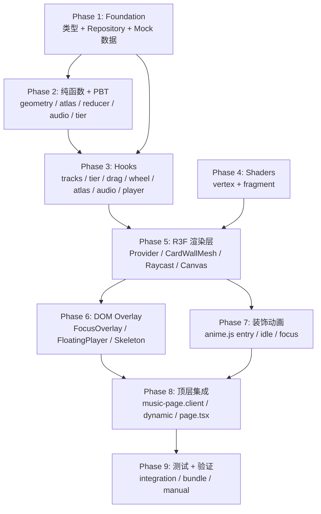

# Implementation Tasks: Music Fisheye Canvas（方案 A：WebGL + R3F）

## Overview

本任务清单基于 `design.md` 与 `requirements.md` 派生，把方案 A（WebGL + R3F + anime.js）的全功能实现拆解为 **9 个 Phase** + 1 个贯穿验证清单 + 1 个 PBT 规范章节。

> **注意**：原 tasks.md 是第一轮 CSS 3D 路线的 42 个任务，所对应的代码（`app/music/layout.tsx`、`components/music/`、`hooks/music/`、`lib/music/`）已全部删除。本清单从零开始。

拆分原则：
- 每个子任务可独立 PR、1–3 小时可完成
- 严格按依赖顺序：**纯函数 → 数据层 → hooks → shaders → R3F 组件 → DOM overlay → 顶层集成 → 测试 → 验证**
- 每个 `lib/music/*.ts` 纯函数模块紧跟一个 PBT 测试任务
- 每个任务显式标注覆盖的 `Requirement / NFR` 与 `Correctness Property`
- 资源已就绪：`public/cover.jpg` + `public/cover.mp3`，所有 mock track 共享这对资源（既验证 atlas 密度也验证悬浮播放器唯一性）
- 测试工具链已就绪：`jest`、`ts-jest`、`@testing-library/react`、`fast-check`、`jest-environment-jsdom`（保留自第一轮，不需要重装）

## Task Dependency Graph

---

## Tasks

- [x] 1. Phase 1 — Foundation：类型、数据层与素材占位
  - [x] 1.1 定义核心 TypeScript 类型
    - 在 `lib/music/types.ts` 新建并导出（按 design.md §11 完整接口）：`Track`、`DeviceTier`、`PlayerState`、`AudioBands`、`AtlasLayout`、`CardSlot`、`FisheyeUniforms`、`MusicCanvasState`、`MusicCanvasAction`、`TrackRepository`、`TierEnv`、`Vec2 = { x: number; y: number }`
    - 字段全部 `readonly`；`Track.coverUrl / audioUrl` 在 JSDoc 中说明 https/同源约束
    - 导出 `INITIAL_STATE: MusicCanvasState` 常量
    - 产出物：`lib/music/types.ts`
    - 验收：`pnpm tsc --noEmit` 通过
    - _Requirements: Requirement 11, NFR-14_

  - [x] 1.2 实现 mock 歌单（共享 cover.jpg + cover.mp3）
    - 新建 `lib/music/mock-tracks.ts` 导出 `MOCK_TRACKS: readonly Track[]`，包含 **96 首占位曲目**（足够铺满 high tier atlas 16×12=192 容量的一半，并覆盖一屏 50+ 卡片密度）
    - 所有 track 共享 `coverUrl: '/cover.jpg'` 与 `audioUrl: '/cover.mp3'`
    - 标题/艺术家/accentColor 用确定性生成器：`title: 'Track ${i+1}'`、`artist: 'Artist ${(i % 12) + 1}'`、`accentColor` 从 12 色调色板循环（蓝/青/紫为主，匹配冷蓝色调）
    - `duration: 180` 占位（cover.mp3 实际短得多没关系，播放时由 audio.duration 覆盖）
    - 文件头注释说明：替换为真实歌单时只需返回不同 Track[]
    - 产出物：`lib/music/mock-tracks.ts`
    - 验收：`MOCK_TRACKS.length === 96`；所有 URL 是相对路径（同源）
    - _Requirements: Requirement 11.1, NFR-14_

  - [x] 1.3 实现本地数据源 + Repository（含 URL 安全校验）
    - `lib/music/local-data-source.ts`：导出 `localTrackDataSource: TrackRepository`，`list()` 返回 `MOCK_TRACKS`、`getById(id)` 线性查找
    - `lib/music/repository.ts`：导出 `createTrackRepository(ds)` 工厂（含简单 in-memory 缓存）+ 默认 `trackRepository = createTrackRepository(localTrackDataSource)`
    - **URL 安全校验**：在 `list()` 内过滤不满足 `https://` 或同源（开头 `/`）的曲目，console.warn 被过滤的 ID（NFR-14.3）
    - 产出物：`lib/music/local-data-source.ts`、`lib/music/repository.ts`
    - 验收：`await trackRepository.list()` 返回 96 项；插入 1 条 `http://...` URL 后该曲目被过滤
    - _Requirements: Requirement 11.2/11.3, NFR-14_

- [x] 2. Phase 2 — 纯函数 + PBT
  - [x] 2.1 实现 `lib/music/geometry.ts`（鱼眼数学 + UV→trackId 反查）
    - 导出 `computeFisheyeScale(distFromCenter, opts) → number ∈ [0,1]`：球面投影后参考缩放（CPU 仿真 shader 输出，便于 PBT）
    - 导出 `uvToCardIndex(uv: Vec2, offset: Vec2, tileCount: Vec2) → { col: number; row: number }`：raycast 命中点 UV 反查卡片行列
    - 导出 `cardIndexToTrackId(col, row, tracks: readonly Track[], tileCount: Vec2) → string | null`：col/row → 一维 idx → 模 tracks.length
    - 导出 `DEFAULT_FISHEYE_OPTS = { curvature: 0.6, vignetteRadius: 1.4, minScale: 0.3 }`
    - 输入校验：非有限/负 minScale 等非法参数 → 回退默认（NFR-10.4）
    - 产出物：`lib/music/geometry.ts`
    - 验收：中心 (0,0) 输出 scale=1；非法参数不抛错
    - _Requirements: Requirement 1.2, Requirement 4, NFR-5_

  - [x] 2.2 PBT：geometry（CP2 + CP3 + CP4）
    - 新建 `__tests__/lib/music/geometry.property.test.ts`，使用 fast-check：
      - **CP2 鱼眼有限性**：任意 `dist ∈ [-2000, 2000]` 输入下 `computeFisheyeScale` 返回有限数 ∈ [0, 1]
      - **CP3 鱼眼镜像对称**：`computeFisheyeScale(d) === computeFisheyeScale(-d)`
      - **CP4 Tile 周期性**：`uvToCardIndex(uv + tileCount, ...)` 与 `uvToCardIndex(uv, ...)` 在 tracks 索引模 length 后一致
      - 非法参数回退默认的单测
    - 产出物：`__tests__/lib/music/geometry.property.test.ts`
    - 验收：`pnpm test geometry` 全过，fast-check 默认 100 次零反例
    - _Requirements: NFR-5, NFR-6; Correctness Properties 2, 3, 4_

  - [x] 2.3 实现 `lib/music/atlas.ts`（图集布局纯函数）
    - 导出 `computeAtlasLayout(trackCount, atlasSize, cardW, cardH) → AtlasLayout`：根据 atlas 尺寸算出 cols/rows/capacity；若 trackCount > capacity 截断并返回 capacity
    - 导出 `slotForIndex(idx, layout) → { col, row, atlasUv: { u0, v0, u1, v1 } }`：算单卡在 atlas 上的 UV 区域
    - 导出 `getTierAtlasParams(tier: DeviceTier) → { atlasSize, cardW, cardH }`：按 design.md §5.2 表（high: 4096/256/320, mid: 2048/192/240, low: 2048/160/200）
    - 产出物：`lib/music/atlas.ts`
    - 验收：`computeAtlasLayout(100, 4096, 256, 320)` → cols=16, rows=12, capacity=192
    - _Requirements: NFR-2_

  - [x] 2.4 PBT：atlas（layout 一致性）
    - 新建 `__tests__/lib/music/atlas.property.test.ts`：
      - 任意输入下 `slotForIndex(idx, layout).atlasUv` 严格在 [0,1]² 内
      - `slot(idx).col + slot(idx).row * cols === idx`（往返一致）
      - `getTierAtlasParams(tier)` 在 tier 退化时 cardW × cardH 不增（单调降级前置）
    - 产出物：`__tests__/lib/music/atlas.property.test.ts`
    - 验收：`pnpm test atlas` 全过
    - _Requirements: NFR-2_

  - [x] 2.5 实现 `lib/music/reducer.ts`（状态机 + 惯性纯函数）
    - 导出 `musicCanvasReducer(state, action): MusicCanvasState`，覆盖所有 design.md §2.3 的 action types
    - 导出辅助纯函数：
      - `applyDelta(offset: Vec2, delta: Vec2): Vec2`
      - `stepInertia(velocity, offset, dt, opts): { velocity, offset, shouldStop }`：指数衰减 `v *= exp(-friction * dt)`
      - `computeInitialVelocity(samples: { dx, dy, t }[]): Vec2`：时间加权平均
    - **关键不变量**（在 reducer 内显式实现，便于 PBT）：
      - `PLAY` 无条件覆盖 `floatingTrackId`（CP6）
      - `FOCUS` 设置 `focusedTrackId`，`UNFOCUS` 清空（CP7）
      - `DRAG_START` 取消 isInertia
    - 导出常量 `INERTIA_OPTS = { friction: 4.0, minVelocity: 0.001, velocityWindowMs: 120 }`
    - 产出物：`lib/music/reducer.ts`
    - 验收：派发 PLAY(A) → PLAY(B) 后 `floatingTrackId === 'B'`；DRAG_START 时 isInertia 立刻为 false
    - _Requirements: Requirement 2, 3, 6, 7, 8, NFR-3, NFR-4, NFR-7, NFR-8_

  - [x] 2.6 PBT：reducer（CP1 + CP6 + CP7 + CP8）
    - 新建 `__tests__/lib/music/reducer.property.test.ts`：
      - **CP1 拖拽可逆**：`applyDelta(applyDelta(o, d), -d)` 与 o 数值容差 < 1e-9
      - **CP6 悬浮唯一**：任意 50 步随机 action 序列后 `floatingTrackId ∈ {null} ∪ trackIds`
      - **CP7 焦点排他**：`focusedTrackId !== null` 时不存在并发态使「另一卡片也清晰」
      - **CP8 惯性单调衰减**：`stepInertia` 连续 1000 帧序列下 `|v_{n+1}| ≤ |v_n|`，并在有限帧数内 `< minVelocity`
    - 产出物：`__tests__/lib/music/reducer.property.test.ts`
    - 验收：`pnpm test reducer` 全过
    - _Requirements: NFR-3, NFR-4, NFR-7, NFR-8; Correctness Properties 1, 6, 7, 8_

  - [x] 2.7 实现 `lib/music/audio-analysis.ts`（splitBands 纯函数）
    - 导出 `splitBands(freqData: Uint8Array, sampleRate: number, prevBands: AudioBands | null): AudioBands`
    - 把 fftSize/2 个 bin 划分为 bass(0-250Hz)/mid(250-4000Hz)/high(4000Hz+)；每段计算 RMS 归一化到 [0,1]
    - **平滑**：与 prevBands 做 lerp（α=0.5），保证相邻两次差值 ≤ 0.5（NFR-9）
    - 导出 `STATIC_BANDS: AudioBands = { bass: 0, mid: 0, high: 0 }`
    - 产出物：`lib/music/audio-analysis.ts`
    - 验收：全 0 输入 → 全 0 输出；全 255 输入 → 接近 1
    - _Requirements: Requirement 9; Correctness Property 9_

  - [x] 2.8 PBT：audio-analysis（CP9）
    - 新建 `__tests__/lib/music/audio-analysis.property.test.ts`：
      - 任意 freqData ∈ Uint8Array(128) 下输出三段 ∈ [0, 1]
      - 连续两次 splitBands（第二次 prevBands = 第一次结果）后 `|Δ| ≤ 0.5`
    - 产出物：`__tests__/lib/music/audio-analysis.property.test.ts`
    - 验收：`pnpm test audio-analysis` 全过
    - _Requirements: NFR-9; Correctness Property 9_

  - [x] 2.9 实现 `lib/music/device-tier.ts`（设备分级纯函数）
    - 导出 `detectDeviceTier(env: TierEnv): DeviceTier`，按 design.md §10.1 规则
    - 优先级：`prefersReducedMotion → 'low'`；`isCapacitor && deviceMemory < 4 → 'low'`；`hardwareConcurrency >= 8 && deviceMemory >= 8 → 'high'`；`hardwareConcurrency >= 4 → 'mid'`；else `'low'`
    - 产出物：`lib/music/device-tier.ts`
    - 验收：`detectDeviceTier({ prefersReducedMotion: true, ... })` → 'low'
    - _Requirements: NFR-1, NFR-12; Correctness Property 10_

  - [x] 2.10 PBT：device-tier（CP10）
    - 新建 `__tests__/lib/music/device-tier.property.test.ts`：
      - 单调降级 PBT：构造一对 env (a, b)，b 在 hardwareConcurrency / deviceMemory 上不优于 a，且 b.prefersReducedMotion ≥ a.prefersReducedMotion → `tierRank(detect(b)) ≤ tierRank(detect(a))`
    - 产出物：`__tests__/lib/music/device-tier.property.test.ts`
    - 验收：`pnpm test device-tier` 全过
    - _Requirements: NFR-1; Correctness Property 10_

- [x] 3. Phase 3 — Hooks 接入层
  - [x] 3.1 `useDeviceTier`
    - 新建 `hooks/music/use-device-tier.ts`：挂载时一次性读取 `navigator.deviceMemory / hardwareConcurrency`、`'ontouchstart' in window`、`matchMedia('(prefers-reduced-motion: reduce)')`、是否 Capacitor (`window.Capacitor` 存在)，调用 `detectDeviceTier`
    - 监听 prefers-reduced-motion 的 change 事件动态切换
    - SSR 安全（首次返回 'mid'）
    - 测试：`__tests__/hooks/music/use-device-tier.test.ts` mock matchMedia
    - 产出物：`hooks/music/use-device-tier.ts` + 测试
    - 验收：mock matchMedia 触发 change → tier 状态更新
    - _Requirements: NFR-1, NFR-12_

  - [x] 3.2 `useTracks`
    - 新建 `hooks/music/use-tracks.ts`：挂载时调用 `trackRepository.list()`，输出 `{ tracks, isLoading, error, retry }`
    - 错误重试逻辑（NFR-10.2）
    - 测试：mock repository 抛错 → error 非空；retry 后重新请求
    - 产出物：`hooks/music/use-tracks.ts` + 测试
    - _Requirements: Requirement 11, NFR-10.2_

  - [x] 3.3 `useDragCamera`
    - 新建 `hooks/music/use-drag-camera.ts`：返回 `{ onPointerDown, onPointerMove, onPointerUp, onPointerCancel, cameraOffset }`
    - 内部用 `lib/music/reducer.ts` 的 `stepInertia / computeInitialVelocity`
    - 滑动窗口采样最近 5 次 (delta, t)；松手时计算时间加权平均速度并启动 RAF 惯性
    - PointerCancel 等同 PointerUp（NFR-10.5）
    - 维护 `dragDistance`：PointerUp 时若 < 5px 则 `onClick(uv)` 派发，否则启动惯性
    - 卸载时 cancelAnimationFrame
    - 测试：fireEvent 模拟 down→move×N→up；模拟 cancel
    - 产出物：`hooks/music/use-drag-camera.ts` + 测试
    - _Requirements: Requirement 2, 3, NFR-3, NFR-4, NFR-10.5; Correctness Properties 1, 8_

  - [x] 3.4 `useWheelCamera`
    - 新建 `hooks/music/use-wheel-camera.ts`：仅当 `deviceTier !== 'low' && !isTouch` 启用
    - 监听 window wheel 事件 → `targetOffset.x/y += deltaX/Y * scale`
    - 通过返回的 `applyDamping(currentOffset, dt)` 在 useFrame 中 lerp 到 target
    - prefers-reduced-motion 时直接关闭（tier 已是 low）
    - 产出物：`hooks/music/use-wheel-camera.ts` + 测试
    - _Requirements: Requirement 5_

  - [x] 3.5 `useCardAtlas`
    - 新建 `hooks/music/use-card-atlas.ts`：根据 `tracks` + `tier` 生成纹理图集
    - **流程**：
      1. 取 `getTierAtlasParams(tier)` 得到 atlasSize / cardW / cardH
      2. 创建 OffscreenCanvas（`'OffscreenCanvas' in window` 否则 fallback HTMLCanvasElement）
      3. 加载所有唯一 coverUrl（去重，本期就一张 cover.jpg）→ `Image` 元素 onload Promise.all
      4. 对每个 track slot：drawImage 封面占顶部 75%；下方 25% 半透明黑控件区，绘制 title 截断 + ⏮ ▶ ⏭ 三键 SVG 路径 + 进度条
      5. canvas → `THREE.CanvasTexture`，设置 `minFilter: LinearMipmapLinearFilter`、`generateMipmaps: true`
    - 返回 `{ texture, layout, isReady, error }`
    - **失败兜底**：OffscreenCanvas 失败 → fallback DOM canvas；drawImage 单卡失败 → 纯色块；上传失败 → 降一档 tier 重试一次（NFR-10）
    - 仅当 `tracks` 引用变化或 tier 变化时重生成
    - 产出物：`hooks/music/use-card-atlas.ts` + 测试（用 mock canvas）
    - 验收：返回的 texture.image 尺寸等于 atlasSize
    - _Requirements: Requirement 10, NFR-2, NFR-10_

  - [x] 3.6 `useAudioAnalyser`
    - 新建 `hooks/music/use-audio-analyser.ts`：接受 `audio: HTMLAudioElement | null`
    - 懒创建 AudioContext + AnalyserNode（fftSize=256），`createMediaElementSource` 用 WeakMap 缓存避免重复
    - RAF 循环读 `getByteFrequencyData` → `splitBands` → 输出 `bands`
    - 暂停 / `prefers-reduced-motion: reduce` / tier='low' 时停止 RAF，bands 归零
    - 卸载时 disconnect + audioContext.close()
    - 产出物：`hooks/music/use-audio-analyser.ts` + 测试
    - _Requirements: Requirement 9, NFR-9_

  - [x] 3.7 `useMusicPlayer`
    - 新建 `hooks/music/use-music-player.ts`：单例 HTMLAudioElement（懒创建）
    - 暴露 `{ playerState, currentTrackId, progress, audio, play(track), pause(), resume(), close() }`
    - `play(B)` 时若已播 A → 先 `audio.pause()` + `audio.src = ''` 释放再切（Requirement 7.4）
    - 监听 `error` 事件 → playerState='error'（Requirement 7.5）
    - RAF 读 `audio.currentTime / duration` → 进度 ∈ [0,1]；暂停时停 RAF（Requirement 8.4）
    - 测试：mock HTMLAudioElement 验证切歌时旧 pause 被调用
    - 产出物：`hooks/music/use-music-player.ts` + 测试
    - _Requirements: Requirement 7, 8, NFR-10.1; Correctness Property 6_

- [x] 4. Phase 4 — Shaders
  - [x] 4.1 实现 vertex shader 字符串（球面投影）
    - 新建 `components/music/shaders/card-wall.ts`，导出 `vertexShader: string`
    - 内容按 design.md §4.2 GLSL 伪代码：球面映射 `pos.z = -uCurvature * (x² + y²)`、入场动画 `mix(-3.0, pos.z, uEntryProgress)`、idle 呼吸 `sin(uTime * 0.6) * 0.015`
    - 输出 varyings：`vUv`、`vDistFromCenter`
    - 产出物：`components/music/shaders/card-wall.ts` 中的 `vertexShader` 字符串
    - 验收：作为 ShaderMaterial 创建时 Three.js 不抛 GLSL 编译错误
    - _Requirements: Requirement 1.2, Requirement 4_

  - [x] 4.2 实现 fragment shader 字符串（atlas 采样 + vignette + audio uniforms）
    - 在同一 `components/music/shaders/card-wall.ts` 导出 `fragmentShader: string`
    - 内容按 design.md §4.3 GLSL 伪代码：`mod` tile 周期性、atlas UV 采样、vignette `smoothstep(1.4, 0.0, vDistFromCenter)`、color grading `mix`、bands 边缘色温叠加、`uEntryProgress` 控制 alpha 淡入
    - 同时导出 `createDefaultUniforms(): FisheyeUniforms` 工厂函数
    - 产出物：`components/music/shaders/card-wall.ts`（合并 4.1 + 4.2）
    - 验收：ShaderMaterial 实例化无报错；空 atlas 下渲染输出（黑屏可接受）
    - _Requirements: Requirement 1.2, Requirement 4, Requirement 9_

- [x] 5. Phase 5 — R3F 渲染层
  - [x] 5.1 `MusicCanvasProvider`（Context + useReducer）
    - 新建 `components/music/music-canvas-provider.tsx`
    - 内部 `useReducer(musicCanvasReducer, INITIAL_STATE)`；调用 `useDeviceTier` / `useTracks`，把 tier / tracks / tracksLoading / tracksError 同步到 state（dispatch 对应 action）
    - 通过 Context 暴露 `{ state, dispatch }`，导出 `useMusicCanvas()` hook
    - 不在 Provider 包裹内调用 `useMusicCanvas()` 抛清晰错误
    - 产出物：`components/music/music-canvas-provider.tsx` + 测试
    - _Requirements: Requirement 1, Requirement 11_

  - [x] 5.2 `CardWallMesh` 组件
    - 新建 `components/music/card-wall-mesh.tsx`（"use client"）
    - 用 `useThree` + `useFrame` 在每帧更新 uniforms：`uTime`、`uOffset`（来自 cameraOffset）、`uBandsBass/Mid/High`、`uEntryProgress`
    - `useMemo` 创建 `PlaneGeometry`（args=[2, 2, segments, segments]），segments 来自 tier（high=128 / mid=64 / low=24）
    - `useMemo` 创建 `ShaderMaterial`（uniforms 用 ref 持有以便外部 anime.js 操控）；transparent: true
    - `useEffect` 注册 cleanup：`material.dispose()` / `geometry.dispose()` / `texture.dispose()`（避免 React 18 strict mode 双挂载泄漏）
    - 接入 `useCardAtlas` 拿到 texture；isReady 前不渲染 mesh
    - 产出物：`components/music/card-wall-mesh.tsx` + 测试（@react-three/test-renderer）
    - 验收：scene.children 中存在 1 个 mesh；卸载后 dispose 被调用
    - _Requirements: Requirement 1, Requirement 4, NFR-2; Correctness Property 5_

  - [x] 5.3 `RaycastClickPlane` 组件
    - 新建 `components/music/raycast-click-plane.tsx`
    - 在 mesh 上挂 `onClick`（R3F 自动 raycast）：从 `event.uv` 取命中点 UV
    - 调用 `lib/music/geometry.ts::uvToCardIndex` + `cardIndexToTrackId` 得到 trackId
    - 派发 `{ type: 'FOCUS', trackId }`
    - **配合拖拽歧义**：仅当 useDragCamera 报告 dragDistance < 5px 时才接受 click（点击/拖拽互斥）
    - 产出物：`components/music/raycast-click-plane.tsx` + 测试
    - _Requirements: Requirement 6.1_

  - [x] 5.4 `MusicCanvasR3F` 容器
    - 新建 `components/music/music-canvas-r3f.tsx`：按 design.md §3.2 完整代码
    - 外层 div：`position: fixed; inset: 0; width: 100vw; height: 100vh; touch-action: none`（**inline style 而非 Tailwind 类，规避 PageTransition transform 污染**）
    - `<Canvas>` 配置：`dpr={[1, tier === 'high' ? 2 : tier === 'mid' ? 1.5 : 1]}`、`gl={{ antialias: true, alpha: false, powerPreference: 'high-performance' }}`、`camera={{ fov: 55, near: 0.1, far: 100, position: [0, 0, 4] }}`
    - 子组件：`<color attach="background" args={['#070912']} />`、`<CardWallMesh />`、`<RaycastClickPlane />`
    - 监听 `onCreated={({ gl }) => ...}`：检查 `gl.getContext().isContextLost()` 用于错误降级
    - 接入 `useDragCamera` 的 PointerEvent handlers 到外层 div（不是 Canvas，避免被 R3F 内部事件拦截）
    - 接入 `useWheelCamera`（仅 desktop + non-low tier）
    - 产出物：`components/music/music-canvas-r3f.tsx` + 测试
    - 验收：在 jsdom 下渲染不抛错（mock @react-three/fiber 即可）；touch-action 在 style 中
    - _Requirements: Requirement 1, 2, 5, NFR-11_

- [x] 6. Phase 6 — DOM Overlay 层
  - [x] 6.1 `MusicSkeleton` 占位组件
    - 新建 `components/music/music-skeleton.tsx`：dynamic loading 期间显示
    - 黑底 + 中央 pulse 圆点 + 「正在加载音乐墙…」文案，无 transform 动画（避免污染 fixed 后代）
    - 产出物：`components/music/music-skeleton.tsx`
    - _Requirements: Requirement 1.4_

  - [x] 6.2 `FocusOverlay` 组件（React Portal）
    - 新建 `components/music/focus-overlay.tsx`：当 `state.focusedTrackId !== null` 时挂载
    - **必须用 `createPortal(node, document.body)`**（规避 PageTransition transform 污染）
    - 全屏背景：`position: fixed; inset: 0; backdrop-filter: blur(20px) saturate(1.6); background: rgba(7, 9, 18, 0.55); z-index: 50`
    - 中央：放大显示焦点曲目的封面 + 标题 + 大尺寸 ▶/⏸ 按钮（接入 `useMusicPlayer`）+ 关闭 X
    - 监听 `keydown Esc` → dispatch UNFOCUS（NFR-12.3）
    - 点击玻璃空白处也触发 UNFOCUS；点击焦点卡片本身 stopPropagation
    - 不卸载已播放的悬浮播放器（Requirement 6.5）
    - 产出物：`components/music/focus-overlay.tsx` + 测试
    - _Requirements: Requirement 6, 7, NFR-7, NFR-12.3; Correctness Property 7_

  - [x] 6.3 `FloatingPlayer` 组件（React Portal）
    - 新建 `components/music/floating-player.tsx`：当 `state.floatingTrackId !== null` 时挂载
    - **必须用 `createPortal(node, document.body)`**
    - 固定 `right: 16px; bottom: 16px; z-index: 60`；玻璃质感按 design.md §7.2
    - 内容：封面缩略图 + 标题 + 独立 RAF 进度条（**不依赖 audio.timeupdate**，避免事件抖动）+ ▶/⏸ + 关闭 X
    - 外圈光晕：从 reducer 读 `audioBands.bass`，驱动 `box-shadow` 的 blur radius + opacity（NFR-9 节流，dband ≤ 0.5/帧 由 splitBands 内部保证）
    - 暂停或 prefers-reduced-motion 时光晕静态（Requirement 9.4/9.5）
    - 关闭按钮触发 `useMusicPlayer.close()` + dispatch CLOSE_FLOATING
    - 产出物：`components/music/floating-player.tsx` + 测试
    - _Requirements: Requirement 8, 9, NFR-8, NFR-9; Correctness Property 6_

- [x] 7. Phase 7 — 装饰动画（anime.js v4）
  - [x] 7.1 `useEntryAnimation`（卡片入场错峰）
    - 新建 `hooks/music/use-entry-animation.ts`：当 `atlasReady === true` 时启动
    - 用 `animate()` + `stagger(20, { grid: [tileCount.x, tileCount.y], from: 'center' })` 把 `entryProgress: 0 → 1`，duration 1400ms，ease 'outExpo'
    - onUpdate 回调写入传入的 `materialRef.current.uniforms.uEntryProgress.value`
    - 卸载时 `animation.cancel()`（v4 API）
    - 产出物：`hooks/music/use-entry-animation.ts`
    - _Requirements: Requirement 1.1, Requirement 10_

  - [x] 7.2 idle 呼吸 timeline（仅 high tier）
    - 在 `MusicCanvasProvider` 或 `CardWallMesh` 内挂载：`createTimeline({ loop: true })` 周期性更新 `uCurvature` 在 base ± 4% 之间，duration 6000ms，ease 'inOutSine'
    - tier !== 'high' 时不挂载（design.md §10.2）
    - prefers-reduced-motion 时不挂载（用 `createScope({ mediaQueries })` 包装）
    - 产出物：合并到 `card-wall-mesh.tsx` 或单独 `hooks/music/use-idle-breath.ts`
    - _Requirements: Requirement 1.2, NFR-1, NFR-12_

  - [x] 7.3 焦点态飞入 + 悬浮播放器进出场
    - 在 `FocusOverlay` 内：`animate(focusCardRef, { scale: [0.9, 1], translateY: ['10%', '0%'], opacity: [0, 1], duration: 600, ease: 'outElastic(1, 0.7)' })`
    - 在 `FloatingPlayer` 内：`animate(playerRef, { translateY: ['100%', '0%'], opacity: [0, 1], duration: 480, ease: 'outExpo' })`
    - 卸载（exit）动画反向播放
    - 产出物：合并到对应组件
    - _Requirements: Requirement 6.1, Requirement 8.1_

- [x] 8. Phase 8 — 顶层集成（NFR-13 落地：动态边界 + 路由隔离）
  - [x] 8.1 创建 `music-page.client.tsx`
    - 新建 `components/music/music-page.client.tsx`（"use client"）
    - 导出 `MusicPageClient`：包 `<MusicCanvasProvider>` → `<MusicCanvasR3F />` + `<FocusOverlay />` + `<FloatingPlayer />`
    - 加错误边界：捕获 R3F 子树异常 → 降级到静态 grid（每张卡片用 next/image 渲染 cover.jpg）
    - 产出物：`components/music/music-page.client.tsx`
    - _Requirements: Requirement 1, NFR-10_

  - [x] 8.2 创建 dynamic 边界
    - 新建 `components/music/music-page-dynamic.tsx`（"use client"）
    - 用 `next/dynamic({ ssr: false, loading: () => <MusicSkeleton /> })` 懒加载 `music-page.client.tsx`
    - 这是 NFR-13 的核心隔离点：所有 three / R3F / drei / animejs 的引用都在 dynamic 边界之后，其他路由不会打包进来
    - 产出物：`components/music/music-page-dynamic.tsx`
    - _Requirements: NFR-13_

  - [x] 8.3 重写 `app/music/page.tsx`
    - 替换占位实现为 Server Component：仅 `import { MusicPageDynamic } from '@/components/music/music-page-dynamic'` 然后 `export default function MusicPage() { return <MusicPageDynamic /> }`
    - **不能有 "use client" 指令**（保持 Server Component 边界）
    - **不能直接 import three/R3F/drei/animejs**（NFR-13.3）
    - 产出物：`app/music/page.tsx`（覆盖现有占位）
    - 验收：访问 `/music` 看到完整鱼眼画布；访问 `/`、其他路由 DevTools Network 不下载 three chunk
    - _Requirements: Requirement 1, NFR-13_

  - [x] 8.4 添加全局错误边界（WebGL 不支持降级）
    - 在 `music-page.client.tsx` 顶层加 ErrorBoundary（class 组件或 react-error-boundary）
    - WebGL context 检测：`!window.WebGLRenderingContext || !canvas.getContext('webgl')` → 直接渲染静态 grid
    - 产出物：合并到 `music-page.client.tsx` 或新增 `components/music/static-grid-fallback.tsx`
    - _Requirements: NFR-10_

- [x] 9. Phase 9 — 集成测试 + 包体积验证 + 手测清单
  - [x] 9.1 集成测试：聚焦 → 播放 → 悬浮 → 切歌
    - 新建 `__tests__/integration/music-flow.test.tsx`
    - 流程：渲染 `MusicPageClient`（mock R3F 为 div）→ mock useTracks 返回 3 首 → 直接派发 FOCUS(track-1) → 断言 FocusOverlay 渲染 → 触发 ▶ 按钮 → 断言 audio.play 被调用 + FloatingPlayer 渲染
    - 切歌：派发 FOCUS(track-2) + ▶ → 断言 DOM 中只有 1 个 FloatingPlayer 且内容是 track-2（NFR-8）
    - 产出物：`__tests__/integration/music-flow.test.tsx`
    - _Requirements: Requirement 6, 7, 8; Correctness Properties 6, 7_

  - [x] 9.2 集成测试：错误路径
    - 新建 `__tests__/integration/error-paths.test.tsx`
    - 覆盖：
      - `useTracks` repository.list 抛错 → 显示空态 + retry 按钮（Requirement 11.5）
      - `useMusicPlayer.play` reject → playerState='error'（Requirement 7.5）
      - PointerCancel 等同 PointerUp（NFR-10.5）
      - 非法 fisheye 参数 → 回退默认（NFR-10.4）
    - 产出物：`__tests__/integration/error-paths.test.tsx`
    - _Requirements: NFR-10_

  - [x] 9.3 包体积验证（NFR-13）
    - 运行 `pnpm run analyze`（`ANALYZE=true next build`）
    - 验证：
      - `/music` 路由首屏 client JS gzip 后 ≤ 250 KB
      - `/`、`/about`、其他路由的 client chunk **不包含** three / R3F / drei / animejs（grep webpack stats 或 bundle analyzer）
    - 产出物：临时 `BUNDLE_REPORT.md` 记录数值（验证后保留作为基线）
    - 验收：两条都满足
    - _Requirements: NFR-13_

  - [x] 9.4 手测清单（保留为长期文档）
    - 新建 `__manual__/music-canvas-checklist.md`，列出：
      - [ ] 桌面 Chrome 1920×1080 一屏 ≥ 50 张卡片，整体球面感明显
      - [ ] 边缘卡片有透视压缩 + 暗角 vignette
      - [ ] 拖拽可漫游、松手有惯性、速度衰减自然
      - [ ] 滚轮平滑滚动（desktop + non-low tier）
      - [ ] 点击卡片进入焦点态、Esc / 点击空白退出
      - [ ] 焦点态点 ▶ → 悬浮播放器出现并随频谱光晕
      - [ ] 切换焦点 + 重新播放 → 仅一个悬浮播放器，内容已替换
      - [ ] Capacitor Android 真机滑动顺畅、touch-action 生效
      - [ ] `prefers-reduced-motion` 时所有装饰动画关闭
      - [ ] WebGL 不支持时降级到静态 grid
      - [ ] 长会话（10 分钟拖拽）内存稳定，无 mesh 增长
    - 产出物：`__manual__/music-canvas-checklist.md`
    - _Requirements: Cross-cutting NFR validation_

---

## Cross-cutting Verification

> 在 Phase 9 完成后由人工验证，PR 合入前 checklist。

### Performance
- DevTools Performance 面板拖拽时 ≥ 55 FPS（无 long task > 50ms）
- 长会话 10 分钟拖拽后 scene.children.length 稳定（CP5）
- atlas 上传一次后无重传（除非 tracks 或 tier 变化）

### Accessibility
- 所有交互按钮有 `aria-label`（▶/⏸/关闭/重试）（NFR-12.2）
- Esc 退出焦点态（NFR-12.3）
- prefers-reduced-motion → tier=low → 装饰动画全关（NFR-12.1）
- WebGL raycaster 无键盘可达性 → 焦点态打开后 Tab 焦点循环在 overlay 内（不跑到 mesh）

### Capacitor Android
- 真机或模拟器访问 `/music`：触摸顺畅、touch-action 生效、惯性自然
- WebGL 在国产 ROM（鸿蒙、MIUI 旧版）上行为：不黑屏即可（差则触发 ErrorBoundary 降级）

### NFR-14 资源安全
- Repository 运行时校验生效（手动注入恶意 URL 验证）
- mock-tracks.ts 静态扫描：所有 URL 是相对路径

### NFR-13 包体积
- Phase 9.3 报告中 `/music` ≤ 250 KB gzipped 且其他路由不含 three

---

## Property-Based Test Specifications

> 10 条 PBT 规范，对应 requirements.md 的 Correctness Properties 1-10。Phase 2 的 PBT 子任务（2.2 / 2.6 / 2.8 / 2.10）逐条落实。CP5 由 Phase 5.2 + 9.1 集成测试覆盖（R3F scene 断言）。

### PBT-1: 拖拽可逆性（CP1）
- **断言**：`applyDelta(applyDelta(o, d), -d) === o`（容差 < 1e-9）
- **被测**：`lib/music/reducer.ts::applyDelta`
- **Generators**：`fc.record({ x: fc.float({ min: -1e6, max: 1e6, noNaN: true }), y: fc.float({ min: -1e6, max: 1e6, noNaN: true }) })`
- **对应需求**：NFR-3

### PBT-2: 鱼眼变换有限性（CP2）
- **断言**：任意 `dist ∈ [-2000, 2000]` 输入下 `computeFisheyeScale` 返回有限数 ∈ [0, 1]
- **被测**：`lib/music/geometry.ts::computeFisheyeScale`
- **Generators**：`fc.float({ min: -2000, max: 2000, noNaN: true, noDefaultInfinity: true })`
- **对应需求**：NFR-5.1

### PBT-3: 鱼眼镜像对称（CP3）
- **断言**：`computeFisheyeScale(d) === computeFisheyeScale(-d)`
- **被测**：`lib/music/geometry.ts::computeFisheyeScale`
- **Generators**：`fc.float({ min: -1000, max: 1000, noNaN: true })`
- **对应需求**：NFR-5.3

### PBT-4: Tile 周期性（CP4）
- **断言**：`uvToCardIndex(uv + tileCount, ...)` 与 `uvToCardIndex(uv, ...)` 模 tracks.length 后输出同一 trackId
- **被测**：`lib/music/geometry.ts::uvToCardIndex` + `cardIndexToTrackId`
- **Generators**：任意 uv ∈ [0,1]² + 任意 tileCount ∈ [1,16]² + 长度 ∈ [1, 200] 的 tracks 数组
- **对应需求**：NFR-6

### PBT-5: 单 mesh / draw call 上界（CP5）
- **断言**：R3F scene 渲染后 `scene.children.filter(c => c.type === 'Mesh').length === 1`（CardWallMesh 是唯一卡片 mesh）
- **被测**：`components/music/card-wall-mesh.tsx`
- **测试方式**：`@react-three/test-renderer` 创建场景后断言 mesh 数量；连续 dispatch 100 次 DRAG_MOVE 后 mesh 数量不变（NFR-2）
- **对应需求**：NFR-2

### PBT-6: 悬浮播放器至多 1（CP6）
- **断言**：任意 50 步随机 action 序列后 `floatingTrackId ∈ {null} ∪ trackIds`
- **被测**：`lib/music/reducer.ts::musicCanvasReducer`
- **Generators**：`fc.array(fc.oneof(PLAY/PAUSE/CLOSE_FLOATING/FOCUS/UNFOCUS actions), { maxLength: 50 })`
- **对应需求**：NFR-8

### PBT-7: 焦点排他性（CP7）
- **断言**：`focusedTrackId !== null` 时不存在并发态使「另一卡片也清晰」（reducer 状态层断言：focusedTrackId 单值）
- **被测**：`lib/music/reducer.ts::musicCanvasReducer`
- **对应需求**：NFR-7

### PBT-8: 惯性单调衰减（CP8）
- **断言**：连续 1000 帧调用 `stepInertia` 后 `|v_n+1| ≤ |v_n|`，且最终 `|v| < minVelocity`
- **被测**：`lib/music/reducer.ts::stepInertia`
- **Generators**：`v0 ∈ [-3, 3]² (px/ms)`、`friction ∈ [0.5, 8]`、`dt ∈ [8, 33]`
- **对应需求**：NFR-4

### PBT-9: 音频反馈有界平滑（CP9）
- **断言**：`splitBands` 输出三段 ∈ [0,1]；连续两次（第二次 prevBands = 第一次结果）的 `|Δ| ≤ 0.5`
- **被测**：`lib/music/audio-analysis.ts::splitBands`
- **Generators**：`fc.uint8Array({ minLength: 128, maxLength: 128 })`
- **对应需求**：NFR-9

### PBT-10: 设备分级单调降级（CP10）
- **断言**：env 沿恶化方向（hardwareConcurrency 减小 / deviceMemory 减小 / prefersReducedMotion 由 false→true）变化时 tier 不会升级
- **被测**：`lib/music/device-tier.ts::detectDeviceTier`
- **Generators**：`fc.record({ hardwareConcurrency: fc.integer({min:1,max:32}), deviceMemory: fc.option(fc.integer({min:1,max:32})), prefersReducedMotion: fc.boolean(), isCapacitor: fc.boolean(), isMobile: fc.boolean() })`
- **对应需求**：NFR-1.3

---

## 任务总览

| Phase | 子任务数 | 预计工时 |
|-------|---------|---------|
| 1. Foundation | 3 | ~2 小时 |
| 2. 纯函数 + PBT | 10 | ~10 小时 |
| 3. Hooks | 7 | ~9 小时 |
| 4. Shaders | 2 | ~2 小时 |
| 5. R3F 渲染层 | 4 | ~7 小时 |
| 6. DOM Overlay | 3 | ~4 小时 |
| 7. 装饰动画 | 3 | ~3 小时 |
| 8. 顶层集成 | 4 | ~3 小时 |
| 9. 测试 + 验证 | 4 | ~5 小时 |
| **合计** | **40** | **~45 小时** |

按 1 人全职 1.2 周 / 串行碎片化 1.5–2 周完成。

---

## 资源约定

- `public/cover.jpg` — 全部 96 首 mock track 共享同一封面（验证 atlas 视觉密度）
- `public/cover.mp3` — 全部 96 首 mock track 共享同一音频（验证悬浮播放器唯一性、切歌切歌切到自己仍正常）

替换为真实歌单时只需修改 `lib/music/mock-tracks.ts`（或在数据层接入真实 Repository），UI 层与 shader 层无感知。
